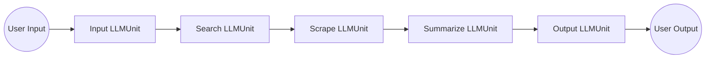
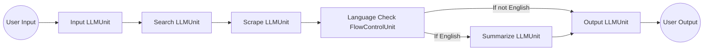
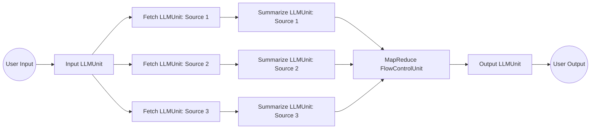

```diagg
+----------------------------+
|          Service           |
+----------------------------+
|           Chain            | 
+--------------+-------------+
|  IOUnit      |   LLMUnit   |
+--------------+-------------+
| Native I/O   |   LLM I/O   |
+--------------+-------------+
```

This diagram presents a simplified, high-level overview of the **CommandChain** framework:

- **Service**: This represents the endpoint or interaction point where users or other systems interface with the CommandChain. It could be an HTTP service, a GraphQL service, or a process initiated by a command-line tool.
- **Chain**: The Service triggers a Chain, which is a series of coordinated tasks involving IOUnits and LLMUnits. The Chain outlines the logic and order of tasks to be accomplished.
- **Unit**: 
  - IO Units interact with external resources or tools (Native I/O), such as opening a file or querying a database. 
  - LLMUnits interface with language learning models (LLM Models) to tap into their advanced capabilities.

## Services

A [Service][service] is the user's primary interface with the system. It can take various forms, such as an HTTP RESTful service, a GraphQL endpoint, or a command-line process, among others. Essentially, a [Service][service] is a perpetually running [Chain][chain], primed to accept user input, carry out actions, and yield responses.

For instance, consider a backend service powered by a language model. This [Service][service] could be exposed as an HTTP RESTful or GraphQL endpoint, waiting for user interactions. Whenever a user sends a request, whether to ask a question or request an operation, the [Service][service] fires up a [Chain][chain]. This [Chain][chain] incorporates [Units][unit] to liaise with the language model, processing the user's query, producing a response through the model, and returning this response to the user via the appropriate endpoint.

## Chains

A [Chain][chain] utilizes various [Unit][unit] in a coordinated manner to reach a desired outcome, acting as a pre-established framework for our application, much like a blueprint. It's modular in nature, allowing a chain to be nested within another, akin to the concept of functional programming.

Additionally, it can be viewed as a discrete step that involves interaction with a language model, external utilities, native systems, among others. It is capable of executing actions in a linear manner. For instance, it can process an input, use it to query Google, interpret the ensuing output, engage with a model, decipher the feedback, and then proceed to the next steps, and so on.

The basic forms are Sequential Chain, Conditional Chain, Parallel Chain.

### Sequential Chain



This diagram represents the process flow of the "FetchAndSummarizeNews" chain. Each rectangle represents an LLMUnit, and the circles represent user input and output. The arrows illustrate the sequence of actions taken by the chain.

### Conditional Chain

A chain can incorporate a FlowControlUnit such as IfElse, MapReduce, and others. This allows for more dynamic and complex behavior within a chain.

For instance, the IfElse FlowControlUnit can be used to branch the execution path based on a condition. The MapReduce FlowControlUnit can be useful in cases where you want to process a collection of data in parallel (map) and then combine the results (reduce).

Here's an adjusted version of our previous example with a hypothetical IfElse FlowControlUnit that checks if the news article is in English:



In this diagram, after scraping the article, the Language Check FlowControlUnit checks if the article is in English. If it is, the article gets summarized. If not, the article gets passed directly to the Output LLMUnit.

### Parallel Chain

A chain can interact with multiple LLMUnits, distributing various tasks among them. Then, it can employ the MapReduce FlowControlUnit to consolidate the results.

Consider an example where a chain named "MultiSourceSummary" fetches and summarizes articles from multiple news websites simultaneously:



In this scenario, the user input is passed to the Input LLMUnit, which then triggers three Fetch LLMUnits (one for each source). Each Fetch LLMUnit gets an article and passes it to a Summarize LLMUnit. The Summarize LLMUnits then summarize their respective articles and pass their outputs to the MapReduce FlowControlUnit, which combines the summaries. The combined summary is then passed to the Output LLMUnit, which presents it to the user.

This type of chain, which interacts with multiple LLMUnits and employs the MapReduce FlowControlUnit to consolidate the results, can enhance parallelism and efficiency, especially when dealing with tasks that can be performed independently.

## Units

[Unit][unit] form the fundamental building blocks of the CommandChain framework, and can be categorized into two types: LLMUnits and IOUnits.

### LLMUnits

LLMUnits, on the other hand, work with language learning models by providing prompts to these models. The purpose of these units is to tap into the advanced capabilities of language models, enabling their integration into the chain's tasks and operations.

Both types of units can operate in different modes - they can be interactive, execute immediately, or function autonomously as agents based on the needs of the chain.

For instance, an LLMUnit named SummaryLLMUnit could interact with a language model to generate a summary of a given text. It would take a piece of text as input, generate a prompt for the language model that asks it to summarize the text, and then provide the language model's response as output. and another LLMUnit, TranslationLLMUnit, could be used to translate a piece of text from one language to another. It would take a piece of text and the target language as input, generate a prompt asking the language model to perform the translation, and then output the translated text.

### IOUnits

IOUnits are designed to interact with external resources or tools. This can include a variety of tasks, such as opening and reading files, making network requests (like querying Google), or executing database operations with SQL. In essence, IOUnits function as the primary interface between the chain and the external environment, facilitating the flow of data in and out of the system.

For example, imagine an IOUnit named GoogleSearchIOUnit. This unit takes in a search query as input and sends a request to Google's search API. The search results obtained from Google are then provided as output to be used by the next unit in the chain. Similarly, a FileReadIOUnit could open a specific file and read its contents. The file contents would then become the output of this unit.

These are just two examples of IOUnits, but they can be designed to interact with any external resource or tool depending on the needs of the application.

:::info
**CommandChain** extensively utilizes [LangChain][langchain]to facilitate interaction with external resources or tools.

See also:
- [LangChain - Data Connection](https://langchain-langchain.vercel.app/docs/modules/data_connection/)
- [LangChain - Memory](https://langchain-langchain.vercel.app/docs/modules/memory/)
:::

## Prompts

A [Prompt][prompt] is like a question or command we give to a language model. Sometimes, we need to adjust these prompts to get the best results. In CommandChain, we use a method similar to Microsoft's guidance language for this.

[Guidance][guidance] is a handy tool that helps us manage advanced language models better. It's more effective than the old ways of prompting or chaining methods. With guidance programs, we can mix and match different processes, like creating new content, giving prompts, and controlling logic in one smooth flow. 

Here are some features it offers:

- It's easy to use, thanks to its simple syntax inspired by Handlebars templates.
- It can produce complex outputs with multiple generations, selections, conditions, and more.

[service]: 1
[chain]: 2
[unit]: 3
[prompt]: 4
[guidance]: https://github.com/microsoft/guidance
[langchain]: https://langchain-langchain.vercel.app/ 