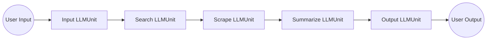
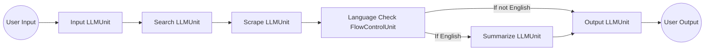
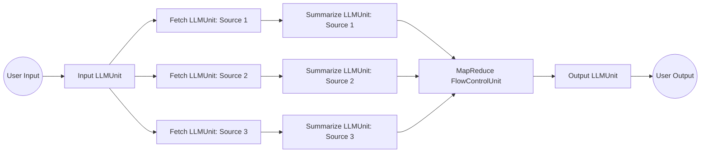

A Chain utilizes various Unit in a coordinated manner to reach a desired outcome, acting as a pre-established framework for our application, much like a blueprint. It's modular in nature, allowing a chain to be nested within another, akin to the concept of functional programming.

Additionally, it can be viewed as a discrete step that involves interaction with a language model, external utilities, native systems, among others. It is capable of executing actions in a linear manner. For instance, it can process an input, use it to query Google, interpret the ensuing output, engage with a model, decipher the feedback, and then proceed to the next steps, and so on.

Let's break down this more complex example, to help understand how we use CommandChain to accomplish our task.

```python
# Import necessary modules
from langchain.llms import OpenAPI
from commandchain.units import IOUnit, LLMUnit
from commandchain.chains import Chain
from commandchain.io import HTTPRequest
```

These lines import the necessary libraries. OpenAPI is used to interact with OpenAI's language model, IOUnit and LLMUnit are the building blocks of our chains, Chain is used to build the workflow, and HTTPRequest is a helper function for making HTTP requests.

```python
# Instantiate the OpenAI language model
llm = OpenAPI(openai_api_key="...", temperature=0.9)
This line initializes the OpenAI's language model with your OpenAI API key and temperature for the model's randomness.
```

```python
# Define the source unit which fetches weather data
source = IOUnit(action=HTTPRequest('GET', 'http://api.weatherapi.com/v1/current.json', params={'key': '...', 'q': 'New York'}))
```

Here we create the source IOUnit, which fetches weather data. It does so by making a GET request to the specified URL, and passing the parameters, including your WeatherAPI key and the query location.

```python
# Define the worker unit that uses LLM to interpret the weather data and generate a friendly message
worker = LLMUnit(llm=llm, prompt=lambda data: f"Translate the weather data '{data}' into a friendly message...")
```

The worker LLMUnit interacts with the language model. The prompt is dynamically generated based on the weather data fetched by the source unit.

```python
# Define the destination unit that prints the friendly weather message to console
dest = IOUnit(action=lambda data: print(data))
```

The dest IOUnit prints the data it receives to the console.

```python
# Create a Chain instance and connect the units
chain = Chain()
chain.connect(source, 'success', worker, 'in')
chain.connect(worker, 'success', dest, 'in')
```

We create an instance of Chain and connect the units. The source unit's success output is connected to the worker unit's input, and the worker unit's success output is connected to the dest unit's input.

```python
# Serve the chain on a specified port
chain.serve(port=3000)
```

Finally, we use the serve method to start the service on port 3000.

Each unit performs its task asynchronously and passes the output to the next unit. If any unit fails, the chain stops and returns the error. This example demonstrates a complex yet powerful way to organize and manage tasks using CommandChain.

The basic forms are Sequential Chain, Conditional Chain, Parallel Chain.

### Sequential Chain



This diagram represents the process flow of the "FetchAndSummarizeNews" chain. Each rectangle represents an LLMUnit, and the circles represent user input and output. The arrows illustrate the sequence of actions taken by the chain.

### Conditional Chain

A chain can incorporate a FlowControlUnit such as IfElse, MapReduce, and others. This allows for more dynamic and complex behavior within a chain.

For instance, the IfElse FlowControlUnit can be used to branch the execution path based on a condition. The MapReduce FlowControlUnit can be useful in cases where you want to process a collection of data in parallel (map) and then combine the results (reduce).

Here's an adjusted version of our previous example with a hypothetical IfElse FlowControlUnit that checks if the news article is in English:



In this diagram, after scraping the article, the Language Check FlowControlUnit checks if the article is in English. If it is, the article gets summarized. If not, the article gets passed directly to the Output LLMUnit.

### Parallel Chain

A chain can interact with multiple LLMUnits, distributing various tasks among them. Then, it can employ the MapReduce FlowControlUnit to consolidate the results.

Consider an example where a chain named "MultiSourceSummary" fetches and summarizes articles from multiple news websites simultaneously:



In this scenario, the user input is passed to the Input LLMUnit, which then triggers three Fetch LLMUnits (one for each source). Each Fetch LLMUnit gets an article and passes it to a Summarize LLMUnit. The Summarize LLMUnits then summarize their respective articles and pass their outputs to the MapReduce FlowControlUnit, which combines the summaries. The combined summary is then passed to the Output LLMUnit, which presents it to the user.

This type of chain, which interacts with multiple LLMUnits and employs the MapReduce FlowControlUnit to consolidate the results, can enhance parallelism and efficiency, especially when dealing with tasks that can be performed independently.
